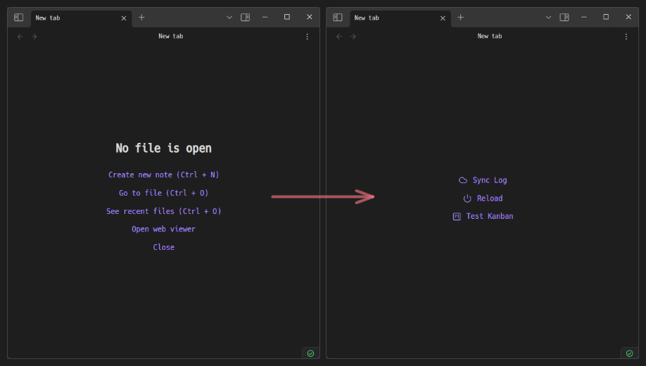
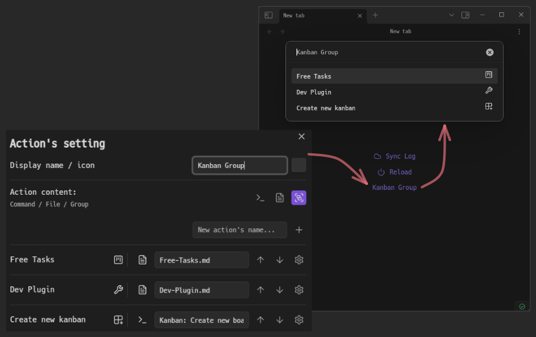
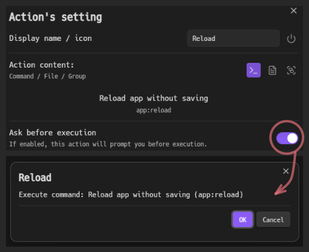

# About Blank

This is a community plugin for [Obsidian](https://obsidian.md/).
- Customize the empty file view (New tab) *itself* a little bit by adding "Actions":
    - Command
    - Open file
    - [Grouped action](#grouped-action)
- Features for convenient use of these actions:
    - [Set icon](#setting---set-icon)
    - [Ask before execution](#setting---ask-before-execution)
    - [Register as a new command](#setting---register-as-a-command)

> [!WARNING]
> The "New tab" feature relies on undocumented Obsidian behavior and may stop working in future versions. However, the command-related features should remain usable as it is designed independently.  
> See [MaintenanceReport](docs/MaintenanceReport.md) for compatibility with Obsidian versions.

## Features

### Customize the New tabs

- When there are no tabs to display, this plugin just shows the default "New tab". So, it does NOT provide "Custom view" or other notes.
    - This means a truly empty file. For example, if you open a new file in this state, the "New tab" will automatically disappear.
- In exchange, the customization options are somewhat limited. You can assign "[Actions](#actions)".
- There is also a function to hide messages and buttons that are displayed by default.

### Actions

"Actions" can be configured to execute existing "Commands" or to "Open files" that you specify. And you can group multiple actions into a single action.

#### Grouped action

- A grouped action contains multiple actions, which can also contain other grouped actions.
- When triggered, this grouped action will display a suggester with a list of all included actions, allowing you to select which specific action you want to execute.
- This feature is intended to prevent "New tab" from being cluttered with "Actions".

#### Settings per action

##### Setting - Set icon

- Set a custom icon to make the action more recognizable.
- This is reflected in "New tabs", [Grouped action](#grouped-action), Mobile toolbar, etc.

##### Setting - Ask before execution

- Displays a confirmation dialog before executing the action (Excluding [Grouped action](#grouped-action)).
- This helps prevent unfortunate incidents when you perform an action by mistake.

##### Setting - Register as a command

- Register the action as a new command in Obsidian.
- In addition to registering "Open file" and "Grouped action" as commands, you can also register existing commands with slight modifications (e.g., Rename, [Set icon](#setting---set-icon), [Ask before execution](#setting---ask-before-execution)).

##### Setting - Display

- Display the action in the "New tab" or not.
- This corresponds to the case where you want to register it as a pure command without displaying it in the "New tab".

### Quick Actions

- This feature groups actions added to the "New tab" as a suggester and registers them as a new command `About Blank: Quick actions`.
    - This means that the "New tab" actions are converted into [Grouped actions](#grouped-action) and [Registered as a command](#setting---register-as-a-command).
- You can call these actions without accessing the "New tab".

## Notes

- If commands are not properly reflected after registering or unregistering them, please reload Obsidian.
- This plugin applies CSS by default to hide the messages and buttons on the "New tab". If the processing for the "New tab" fails to work properly, nothing may be displayed on the "New tab".
- You can disable "New tab" and "Quick actions" features by turning off the "Add actions to New tabs" setting. This is useful if you only want to use the command-related features or if these features stop working in future versions.

## ToDo

- [ ] Setting how opens the file.
- [ ] Improve dialog usability.
- [ ] Add a method to display actions on the "New tab".
- [ ] Implementing copy/move action functionality.

## License

This project is licensed under the MIT License, see the LICENSE file for details.
